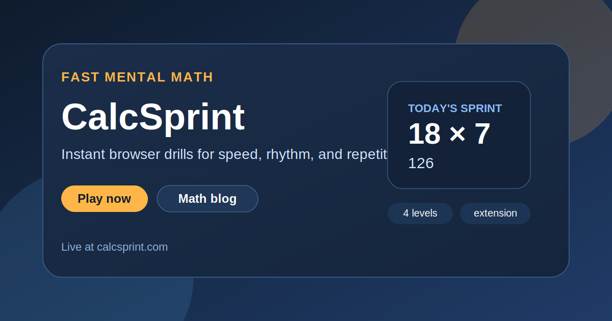

  

<h1 align="center">CalcSprint</h1>

  Fast mental math drills with a clean browser-first interface, instant rounds, and lightweight training loops built for daily repetition.

  <a href="https://calcsprint.com/"><strong>Play Now</strong></a>
  ·
  <a href="https://calcsprint.com/blog/"><strong>Math Blog</strong></a>
  ·
  <a href="https://calcsprint.com/browser-extension/"><strong>Browser Extension</strong></a>
  ·
  <a href="https://chromewebstore.google.com/detail/calcsprint/ipfgjadncddiilmlankkmlimngbglnai"><strong>Chrome Extension</strong></a>

  

## What It Is

CalcSprint is a lightweight mental math product built for short, repeatable training sessions. Open the site, start solving immediately, and stay inside one tight loop: see the task, answer fast, move on.

This public repository is a GitHub showcase for the live product. It is meant to explain the experience quickly, link the main sections, and make the project easy to discover.

## Live Sections

| Section | Link | Purpose |
| --- | --- | --- |
| Home | [calcsprint.com](https://calcsprint.com/) | Main speed-math game with instant rounds |
| Blog | [calcsprint.com/blog/](https://calcsprint.com/blog/) | Short mental math tips, habits, and practice advice |
| Browser Extension | [calcsprint.com/browser-extension/](https://calcsprint.com/browser-extension/) | Toolbar version for quick micro-training |
| Russian | [calcsprint.com/ru/](https://calcsprint.com/ru/) | Localized home page |
| German | [calcsprint.com/de/](https://calcsprint.com/de/) | Localized home page |
| Spanish | [calcsprint.com/es/](https://calcsprint.com/es/) | Localized home page |

## Extension Install Links

| Browser | Status | Install |
| --- | --- | --- |
| Chrome | Live | [Install from Chrome Web Store](https://chromewebstore.google.com/detail/calcsprint/ipfgjadncddiilmlankkmlimngbglnai) |
| Edge | Coming soon | Use the [browser extension page](https://calcsprint.com/browser-extension/) for launch updates |
| Firefox | Coming soon | Use the [browser extension page](https://calcsprint.com/browser-extension/) for launch updates |
| Opera | Coming soon | Use the [browser extension page](https://calcsprint.com/browser-extension/) for launch updates |

## Why It Feels Different

- The game starts immediately instead of making you click through onboarding.
- Sessions are intentionally short, so repetition feels natural instead of heavy.
- The interface is minimal and mobile-friendly.
- Blog and localization pages help the product grow beyond one single landing page.
- The extension keeps the same lightweight philosophy inside the browser toolbar.

## Project Snapshot

- Topic: mental math and arithmetic speed training
- Stack: HTML, CSS, vanilla JavaScript
- Modes: multiple difficulty levels, endless drills, browser extension
- UX goal: fast repetition with low friction
- SEO goal: localized pages, blog support, clean information architecture

## More Projects

| Project | Live site | Public repo |
| --- | --- | --- |
| SkillSudoku | [skillsudoku.com](https://skillsudoku.com/) | [skillsudoku_public](https://github.com/ivanlukichev/skillsudoku_public) |
| Number Hunt | [numberhuntgame.com](https://numberhuntgame.com/) | [numberhuntgame](https://github.com/ivanlukichev/numberhuntgame) |
| PlayMathPuzzles | [playmathpuzzles.com](https://playmathpuzzles.com/) | [PlayMathPuzzles](https://github.com/ivanlukichev/PlayMathPuzzles) |
| Sudoku Play | [sudoku-play.org](https://sudoku-play.org/) | [Sudoku-Play](https://github.com/ivanlukichev/Sudoku-Play) |

## Visit

  <a href="https://calcsprint.com/"><strong>Open CalcSprint</strong></a> 
  <a href="https://calcsprint.com/blog/">Read the Math Blog</a> 
  <a href="https://calcsprint.com/browser-extension/">See the Browser Extension</a> 
  <a href="https://chromewebstore.google.com/detail/calcsprint/ipfgjadncddiilmlankkmlimngbglnai">Install the Chrome Extension</a>

